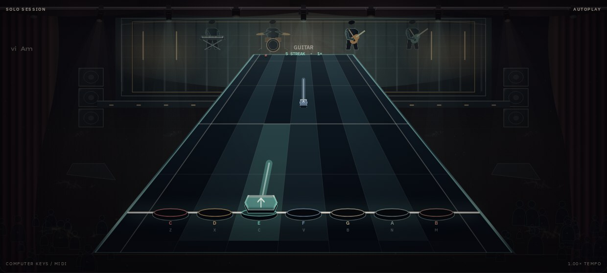

# Concert graphics and strum guide

The concert pass gives the existing Canvas2D stage a machined highway, beveled
note faces, illuminated sustain cores, inset strike targets, and a club backdrop
with acoustic slats, warm sconces, speaker stacks, monitors, performers and crowd
silhouettes. Drums retain round heads; melodic notes use a faceted head. Perfect
hits have a short impact core and directional sparks. Chord judgments display
one grade and one separate streak milestone per player.

Static club art is cached at the viewport's capped device-pixel ratio. Performer
and note materials are small, reusable canvases. Resizing replaces the scenery
cache; an unchanged viewport reuses it. There are no external graphics assets,
network dependencies, or renderer-library changes. Reduced motion freezes ambient
lighting and performer/crowd motion, hides particles, and keeps moving notes.

## Song lighting

Beat pulses follow the chart’s beat grid and bar accents. Fixtures, crowd motion
and light patterns use song time, so pause and seek preserve their alignment.
Existing section markers crossfade the stage through three complementary palettes.

Backing audio adds bass and overall-level response through a reusable analyser
on the backing bus. Microphone input, instrument monitoring, guide tones and the
metronome do not drive the lights. Analysis happens before master volume, so
muting does not remove the visual rhythm. Calm and reduced-motion modes disable
beat, section and audio animation.

## Strum arrows

Enable **Strum arrows** beside the tempo and listening controls when a guitar
player or a rhythm chart is selected. The choice is saved locally. It can change
during playback without resetting the score, held notes, or audio clock.

- **↓ Downstrum:** nearest full beat.
- **↑ Upstrum:** nearest half beat.
- This is a **suggested eighth-note hand pattern**, anchored to the chart's beat
  grid and first-beat offset. Missing notes do not flip subsequent directions;
  simultaneous notes receive the same suggestion.
- Suggestions are visual guidance only. MIDI, keyboard and touch scoring do not
  check physical strum direction.
- Audio imports do **not** detect the original player's picking or strumming.
  The on-screen legend explicitly states this. Complex/sixteenth-note or swung
  picking patterns may need a different practice pattern.

A **NEXT STRUM ↓ DOWN / ↑ UP** cue above the highway previews the next unplayed
note for the first eligible player. On phones it gets a dedicated row beneath
the energy meter; score bonuses stay on the highway to keep the HUD readable. It skips
judged and held notes without changing scoring. An unplayed cue remains visible
through the active difficulty and tempo’s late-hit window, advancing when the
note is hit or expires.

The arrows follow chart time, so pause, resume, replay and tempo changes retain
the same suggestions. Keys, bass and drum pitch charts retain their normal note
heads. Rhythm charts can use arrows regardless of their assigned instrument.

## Verification

`npm run test:graphics` runs against the development server with real Chromium
Canvas2D. It checks desktop and phone dimensions for dense chords, solo rhythm,
four-player charts, perfect-hit feedback, Calm, and guitar/rhythm strum arrows.
It verifies lane hit-testing, unchanged-size cache reuse, reduced-motion pixel
stability, feedback de-duplication, and live/persisted strum-toggle behavior.
It also checks real backing-bus audio analysis, monitor isolation, muted playback,
pause stability, wall-clock independence, visible audio response and the next-strum HUD.

`SESSION_SCREENSHOT_DIR=/workspace/screenshots/concert npm run test:graphics`
saves captures. Optional `GRAPHICS_BASELINE_MODULE` supplies a development module
URL exporting a previous `StageRenderer` for local timing comparisons.

The timing report forces a canvas readback and measures the browser's software
raster path. It is diagnostic, not an assertion of hardware frame rate. A steady
60 fps target still requires profiling on a physical phone and desktop.

The audio regression also scores real imported audio with arrows enabled. The
unit tests cover beat offsets, sparse rhythms, chords, timing jitter and saved
preferences. Existing session/setup/import regressions remain part of CI.

## Preview

